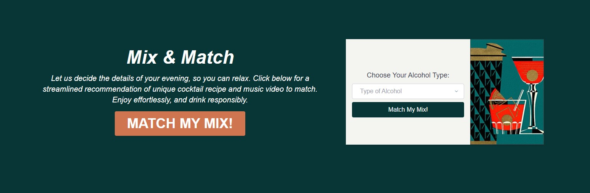

# 07 Project 1: Mix & Match: Cocktail & Music Video Generator

## Concept

AS A user
I WANT to a recommendation for a cocktail and curated music video
SO THAT I can find new, exciting mixed drinks and music without requiring research

## User experience

- The user is greeted with a landing page. They then click the "Match My Mix" button to get started.

- A modal appears, asking the user to verify their age. Once that is complete, the user can select a type of alcohol. Click the "Match My Mix" button, and see the results.

- The results will include an image of the recommended drink, the recipe for creating this concoction, and a video selected as a companion to the user-selection.

## Task

Work with a group of fellow students to create a collaborative project.

## Team challenges

Create user story to describe real-world problem the application will address.

Divide up duties, and share skills and knowledge, lean on team-member strengths.

Present project to instructional staff and fellow students.

## Technologies employed

- Third-party server-side API calls.

- Uses modal to prompt user input

- Interactive with user input

- Tailwindcss framework

- Dynamic DOM manipulation

- Set and get localStorage

- Responsive design

## Future development

- Search from list of previous searches

## Wireframe

## Screenshot

## Link

https://isayani.github.io/cocktail-music-generator/
